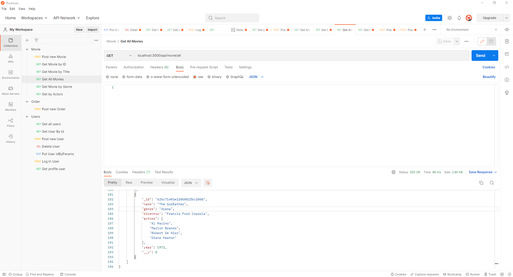

# Toc

- [Toc](#toc)
- [Buscador de películas](#movie-finder)
- [Cómo usarla](#how-to-use-it)
- [Busquedas](#endpoints)
  - [Identificación de Usuario](#auth-user)
  - [Buscador de Películas](#get-movie)
  - [Pedidos](#orders)
  - [Usuario](#user)
  - [Super Administrador](#superadmin)
  - [Autores](#author)
      - [Marc Serrats Pagès :es:](#marc-serrats-pagès-es)
      - [Ibrahim Alzuru Cortés  :venezuela:](#ibrahim-alzuru-cortés--venezuela)
      - [Luciano Germani :it:](#luciano-germani-it)

# Buscador de películas

*Si lo prefieres puedes leer esto en* [English](README.md)

Este proyecto es una replica de un motor de búsqueda en una base de datos de películas.

# Cómo usarla

Para poder usarla necesitarás instalar Postman ((https://www.postman.com/) y apunta a este servidor de heroku: https://buscadordepeliculas.herokuapp.com/

# Busquedas

Aquí puede encontrar todos los métodos que puede usar en Postman para poder hacer sus busquedas.

## Identificación de Usuario

    URL: POST / api / auth / register --> You can register an account
    BODY {"name": " ", "email": " ", "password": " " }  

    ---------------------------------------------------------------

    URL: POST / api / auth / login  --> You can login with your account  
    BODY {"email": " ", "password": " " }  
    ---------------------------------------------------------------

    URL: GET / api / auth / profile --> You can see your profile
    
    

## Buscador de Películas

    GET /api/movie/id=:id  --> Puedes buscar las películas por Id
    URL: ID Movie
    ---------------------------------------------------------------
    GET /api/movie/ --> Puedes buscar las películas por título
    BODY {"name": " " }
    ---------------------------------------------------------------
    GET /api/movie/all --> Puedes buscar todas las películas de la bse de datos.
    ---------------------------------------------------------------
    GET /api/movie/director --> Puedes buscar todas las películas realizadas por un director
    URL: "Director Name"
    ---------------------------------------------------------------
    GET /api/movie/actors/:actors --> Puedes buscar todas las películas filtrando por un actor en concreto
    ---------------------------------------------------------------
    GET /api/movie/genre/:genre --> Puedes filtrar todas las películas de un mismo genero

    

## Pedidos

    POST /api/order/:id --> Puedes publicar un nuevo pedido.
    ---------------------------------------------------------------

## Usuario
    GET /api/users/:id --> Puedes obtener al usuario por su propia identificación.
    ---------------------------------------------------------------
    DELETE /api/users/:id --> Puedes eliminar tu cuenta
    ---------------------------------------------------------------
    PUT /api/users/:id --> Puedes modificar tu cuenta

    
## Super Administrador

    GET /api/users --> Puedes ver a todos los usuarios
    ---------------------------------------------------------------
    GET /api/orders --> Puedes ver todos los pedidos
    ---------------------------------------------------------------
    GET /api/orders/user --> Puede ver todos los pedidos de un usuario en particular.

   
## Autores 	

#### [Marc Serrats Pagès](https://github.com/pagesMp) :es:
#### [Ibrahim Alzuru Cortés ](https://github.com/ibralzuru) :venezuela:
#### [Luciano Germani](https://github.com/Germanilu) :it:
 

---------------------

[:top:](#toc)